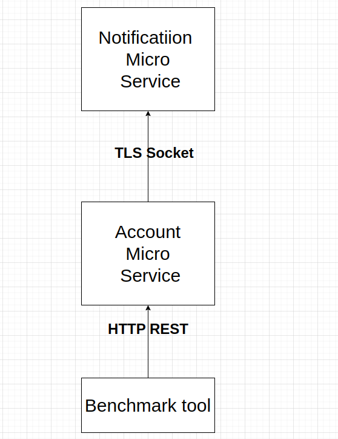

# Thanks for considering me in your job applicant interviews 

## System Design 
I implemented the project on microservice architecture, I decided to consider separate services
for account and notification.<br>

## Service's Architecture 


### Why socket 
The best way possible for implementing connection between microservices
for implementing event driven 
scenarios like the one that we have for account transfer notification
is using an event streaming platforms like Kafka, 
but I decided to show my golang skills (especially for parallell|concurent solutions) by implementing it purely on socket, by implementing it purely on socket I have more things to implement and more
challenges and problems to solve. 

## How to setup
run in notification and account directories 
```
go mod vendor 
```

run containers by docker compose 
```
docker compose up -d
```

send http requests

list accounts
```
 curl -X GET localhost:8000/api/accounts/ 
```
create account
```
curl -X POST -d '{"accountID":4,"balance":20.5}' localhost:8000/api/accounts/
```

send transaction 
```
 curl -X POST -d '{"fromID":4,"toID":3,"amount":1}' localhost:8000/api/accounts/send/
```
## Benchmark and notification 
first of all please see logs to better understand how it works
```
docker compose logs -f 
```

you can get benchmark using benchmark tool that I developed for you -n option is the
count of transactions , the benchmark tool will create accounts automatically for you
```
go run ./benchmark/main.go -n 10000
```

this is the result in my system for 100K requests
```
Successful requests: 100000
Failed requests: 0
Benchmark: 26.301355297s 
```

you can see saved notifications by going to bash of the notification and cd to the logs directory
```docker compose exec notification bash```
```
cd /app/logs
ls
```
